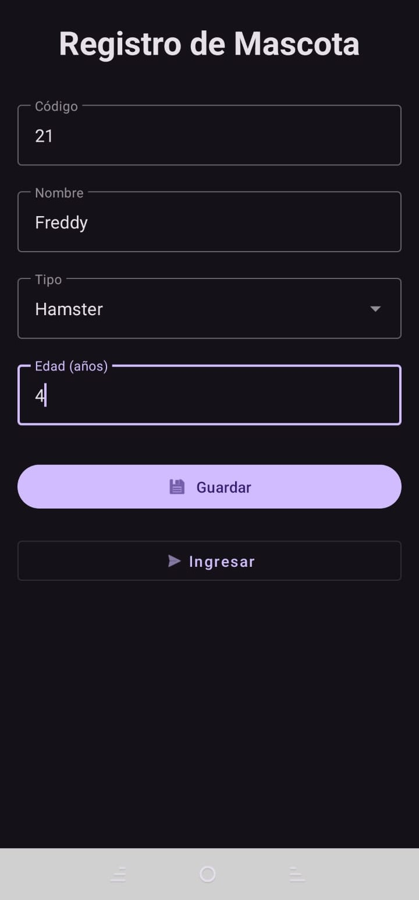
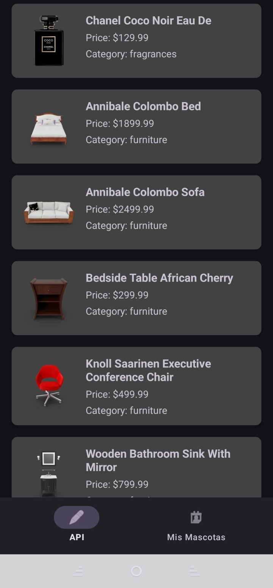
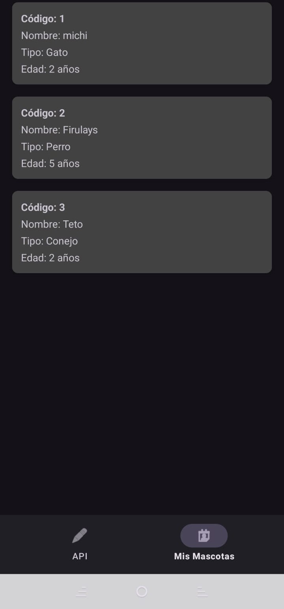

# 🐾 Aplicación de Gestión de Mascotas

Aplicación móvil desarrollada en **Kotlin** para Android como proyecto de práctica. Permite registrar mascotas localmente mediante **Room Database** y consultar productos desde una **API REST**, implementando la arquitectura **MVVM** y demás características descritas abajo.

Clasificación del proyecto: Principiante - Intermedio

---

## 📱 Características

✅ Registro de mascotas.
✅ Almacenamiento local con Room Database.
✅ Visualización de mascotas registradas.
✅ Consumo de la API REST **DummyJSON** mediante Retrofit.
✅ Visualización de productos con RecyclerView.
✅ Carga de imágenes mediante Glide.
✅ Navegación entre pantallas con BottomNavigationView.
✅ Arquitectura MVVM.
✅ ViewBinding.
✅ Uso de LiveData y Coroutines.

---

## 🛠️ Tecnologías utilizadas

- Kotlin
- Android Studio
- Room Database
- Retrofit
- Glide
- RecyclerView
- LiveData
- ViewModel
- Coroutines
- Material Design

---

## 🌐 API utilizada

La aplicación consume la siguiente API pública:

**DummyJSON**

```
https://dummyjson.com/products
```

De cada producto se muestran los siguientes datos:

- Título
- Precio
- Categoría
- Imagen (thumbnail)

---

## ▶️ Requisitos

- Android Studio Koala o superior.
- JDK 17.
- Android SDK 35 o superior.
- Android Gradle Plugin **8.10.1**.

---

## 🚀 Instalación

1. Clonar el repositorio.

```bash
git clone https://github.com/HereticSoba/Practice_Android_Studio.git
```

2. Abrir el proyecto con Android Studio.

3. Esperar a que Gradle sincronice las dependencias.

4. Ejecutar la aplicación en un emulador o dispositivo físico.

---

## ⚠️ Problemas comunes

### ❌ Error de Gradle

Si aparece un error similar a:

```text
Plugin [id: 'com.android.application', version: '8.10.2'] was not found
```

### ✔️ Solución

Abrir el archivo:

```text
gradle/libs.versions.toml
```

Cambiar:

```toml
agp = "8.10.2"
```

por:

```toml
agp = "8.10.1"
```

Guardar los cambios y sincronizar nuevamente el proyecto (**Sync Now**).

---

### ❌ Error de Room Database

Si aparece el mensaje:

```text
Cannot access database on the main thread
```

Verificar que las operaciones de acceso a la base de datos se ejecuten mediante **corrutinas** y que los métodos correspondientes del DAO estén definidos como `suspend`.

Ejemplo:

```kotlin
@Insert(onConflict = OnConflictStrategy.IGNORE)
suspend fun insertar(vararg mascota: Mascota)
```
---

## 📸 Screenshots

<table align="center">
<tr>
<td align="center">



**Formulario de Ingreso de Datos**

</td>

<td align="center">


**Ingreso de Datos Exitoso**

</td>
</tr>

<tr>
<td align="center">



**Listado Productos del API**

</td>

<td align="center">



**Listado Mascotas**

</td>
</tr>
</table>


## 👨‍💻 Autor

**HereticSoba (Diego)**

Proyecto desarrollado con fines académicos.
